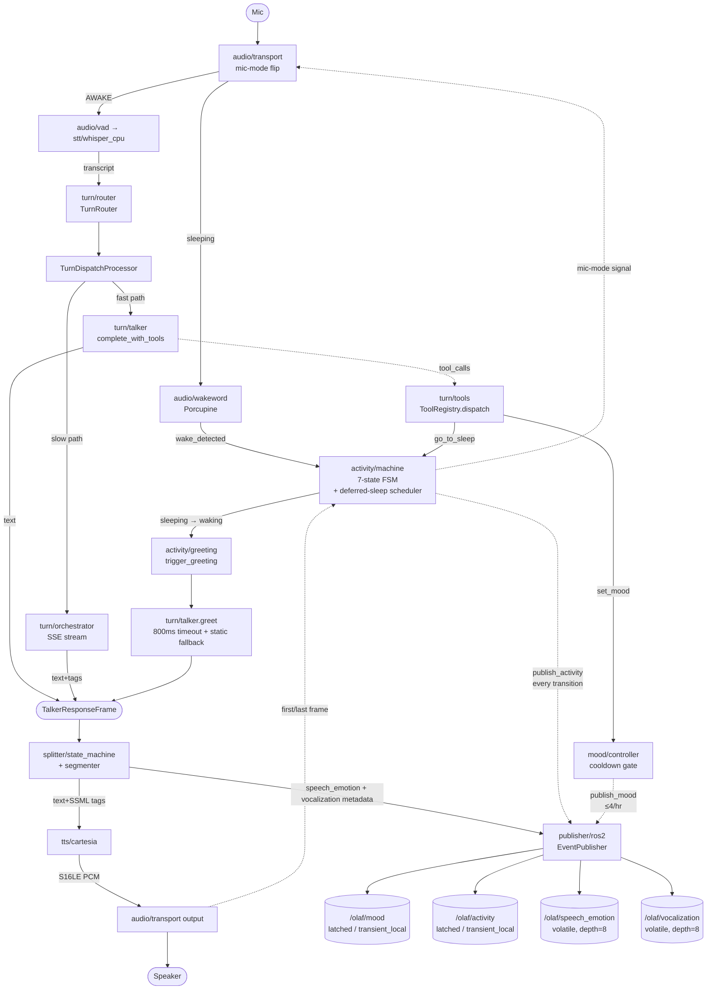

# Architecture Decision Document — voice-agent-pipeline

_This document builds collaboratively through step-by-step discovery. Sections are appended as we work through each architectural decision together._

## Project Context Analysis

### Component Scope

`voice-agent-pipeline` is a Pipecat-based voice-agent component. Its responsibility:

- **In scope:** local audio I/O, wake-word detection, on-device STT, in-pipeline tool-using LLM (Talker, with `go_to_sleep` + `set_mood` tools), orchestrator dispatch, Cartesia TTS, streaming SSML splitter, **typed event publish on four configurable topics — `mood`, `activity`, `speech_emotion`, `vocalization` — sharing a common envelope**, activity FSM (7 states), mood control with publisher-boundary cooldown.
- **Out of scope:** physical embodiment (any robot, screen, motor, LED, display), pose interpolation/ease curves, host hardware design, idle/non-voice ambient behaviors (downstream concern).

The component is **consumer-agnostic**. The event envelope, the four topic-specific payload schemas, and the topic names are the only things downstream cares about — and topic names are config values, not architecture.

**v1 deployment platform:** local Linux PC. Pi 5 + Hailo-8L port is v2.

### Requirements Overview

**Functional Requirements (53 declared, 49 v1-active, 11 clusters; FR28 removed; FR5/FR29/FR30 deferred to v1.5):**

| Cluster | FRs | Architectural implication (v1) |
|---|---|---|
| Audio I/O & Capture | FR1–FR5 | Always-on wake-word + VAD-bounded capture + mic-mode-aware capture in one Pipecat input stage; device pinning by stable name. FR5 (barge-in) deferred to v1.5. |
| Speech Recognition | FR6–FR8 | On-device Whisper running on host CPU/GPU as available; confidence-based clarification routing. No Hailo dependency in v1. |
| Conversational Intelligence | FR9–FR14 | TurnRouter decides Talker vs orchestrator; in-pipeline tool-using LLM client; belief-state HTTP client; orchestrator SSE consumer; greeting-mode invocation surface (FR12). |
| Voice Synthesis | FR15–FR17 | Cartesia streaming client; FR16 (degraded mode) deferred to v2 resilience layer. |
| Embodiment Expression | FR18–FR25 | Streaming SSML parser, segmentation, mapping table (full primary + secondary + family fallback), audio-frame metadata threading, **publish to `speech_emotion` and `vocalization` topics via `EventPublisher`**, last-published cache. **Top-priority v1 quality bar.** |
| Lifecycle (Activity) FSM | FR26–FR30 | 7-state activity FSM (`starting, sleeping, waking, listening, working, speaking, going_to_sleep`); `working` sub-modes (`thinking, delegating`); deferred-sleep transition; publishes to `activity` topic. FR29/FR30 (barge-in flush + STT preserve) deferred to v1.5. |
| Wake/Sleep & Tool-Use | FR44–FR47 | Wake greeting via Talker greeting-mode on `sleeping → waking` (FR44, 800 ms timeout, static fallback list); Talker tool registry `{go_to_sleep, set_mood}` with typed Pydantic input validation (FR45); deferred-sleep semantics — `go_to_sleep` schedules transition for after acknowledgement audio finishes (FR46); continuous mic capture while AWAKE — wake-word fires only on `sleeping → waking` (FR47). |
| Mood Control | FR48–FR50 | Discrete mood enum; `MoodController` with publisher-boundary cooldown (≤4/hr per NFR31); v1 lifetime is single-process (cross-restart persistence v1.5). |
| Event Publishing & Channels | FR51–FR53 | Four typed ROS 2 topics (`mood` + `activity` latched/transient_local; `speech_emotion` + `vocalization` volatile); common envelope `{timestamp, schema_version, source, correlation_id, payload}`; `schema_version=2` (bumped due to topology change). |
| Configuration & Operations | FR31–FR36 | `setup.toml` + `.env` + `expression_map.yaml` loaders, schema validation, SIGHUP atomic swap (mapping only), systemd unit. |
| Observability & Diagnostics | FR37–FR43 | Structured JSON logs, level discipline, local rotation, no telemetry, no persistence. |

**Non-Functional Requirements (32 total, v1 active set):**

| Category | v1-active NFRs | Architectural driver |
|---|---|---|
| Performance | NFR1–NFR7 | Audio frame metadata anchoring; minimal buffering; concurrency keeps critical path off blocking calls. Validated on local PC for v1; Pi calibration in v2. |
| Wake-greeting + tool-call performance | NFR30, NFR32 | Talker greeting-mode 800 ms timeout with static fallback (NFR30); tool-call execution overhead bounded — validation + dispatch off the audio hot path (NFR32). |
| Reliability | NFR8, NFR10, NFR11 | systemd restart-on-failure is the v1 recovery; soak testing on real ambient. |
| Wake-word accuracy | NFR12, NFR13 | Tuning targets at production threshold; soak validates. |
| Mood cadence | NFR31 | Cooldown enforced at the `MoodController.set()` boundary — over-rate `set_mood` calls are dropped with WARN; in-process mood state not updated on drop. |
| Resource | (Spirit only in v1) | Don't be a hog on the host. Pi 5-specific thresholds (NFR14–18) are v2 calibration. |
| Integration | NFR21 | All four configured topics use reliable delivery; per-topic QoS tuned (latched/transient_local for `mood`/`activity`; volatile/depth=8 for audio-anchored `speech_emotion`/`vocalization`). |
| Security | NFR23–NFR25 | Credentials from `.env` loaded once at startup; TLS strict; logger filter for raw audio/transcripts. |
| Maintainability | NFR26–NFR29 | Components testable in isolation with mock/synthetic inputs; schema versioning; canonical specs. |

### Scale & Complexity

- **Primary domain:** real-time voice-agent software (publishes events to a broadcast bus, agnostic about consumers)
- **Complexity level:** medium — driven by latency budgets and concurrency, not feature count
- **Estimated logical components:** ~14–17 (most as Pipecat processors; +2–3 from the direction shift: `MoodController`, `ToolRegistry`, deferred-sleep scheduler in `activity/`)
- **Audience:** single-user (Kamal); no multi-tenancy, no auth surface beyond API keys, no compliance regime

### V1 Posture: Hard Dependencies, Fail-Fast

External dependencies are **hard-required** in v1. At startup the pipeline validates:

- Cartesia API key configured + reachable
- Active Talker provider's API key configured + reachable (one of OpenAI / Groq / Gemini per `setup.toml`)
- Orchestrator daemon reachable
- Broadcast bus connection established — `EventPublisher` initialized with all **four** topic publishers (`mood`, `activity`, `speech_emotion`, `vocalization`)
- Audio devices (mic, speaker) resolvable by their configured names
- Talker tool registry validates against typed Pydantic schemas (`go_to_sleep`, `set_mood`); registry must be loadable

If any check fails, the pipeline refuses to start with a clear error.

**At runtime, failures crash the process; systemd restarts it.** No retry-with-backoff, no partial-mode fallbacks, no in-process recovery. This trades resilience for simplicity so v1's quality budget concentrates on **`speech_emotion` mapping completeness** (the Cartesia tag → topic-payload table, scoped specifically to the `speech_emotion` topic — `mood` and `activity` are FSM-driven, not audio-tag-driven).

### Deferred to v1.5 / v2

**Deferred to v1.5 (next minor — additive features that didn't make the v1 quality bar):**

| Item | Deferred FRs/NFRs | v1.5 behavior |
|---|---|---|
| Barge-in mid-response | FR5, FR29, FR30 | VAD-during-SPEAKING flush + `DELETE /turn/{id}` cancellation; SPEAKING→LISTENING bypass with audio-frame-anchored splitter flush; STT continues capturing during `going_to_sleep` so a follow-up wakes the system back up. |
| Expanded `working` sub-modes | (additive) | `searching` (RAG / web tool), `tooling` (function/tool calls beyond go_to_sleep / set_mood), `composing` (long-form streaming). v1 ships with `{thinking, delegating}` only. |
| Cross-restart mood persistence | (additive — under FR48) | Persist current mood to a small state file on shutdown; restore on startup. |
| Configurable idle auto-sleep | (additive) | Optional fallback if Talker fails to detect goodbye. v1 is intent-only. |

**Deferred to v2 — Resilience layer (per-external-dep adapter + degradation policy):**

| Dependency | Deferred FRs/NFRs | v2 behavior |
|---|---|---|
| Talker (any provider) | NFR22 | Reroute to orchestrator slow-path on Talker failure |
| Orchestrator stream | FR13, NFR20 | Stall heartbeat + filler response; reconnect on disconnect |
| Cartesia | FR16, NFR19, NFR9 | Retry with exponential backoff; text-only degraded mode signaled by `speech_emotion` event with `emotion="sad"`; 5s recovery target |

**Deferred to v2 — Pi + Hailo-8L port (deployment / optimization phase):**

| Concern | Deferred FRs/NFRs | v2 behavior |
|---|---|---|
| Hailo-8L acceleration | FR7, FR41 | Use Hailo-8L when present for Whisper inference; CPU fallback path with logged warning if missing |
| Pi-specific resource thresholds | NFR14, NFR15, NFR16, NFR17, NFR18 | Calibrate to Pi 5 envelope; thermal headroom; active cooling |

**v1 design constraint:** components touching external deps sit behind thin adapters so v2 can drop in resilience policy without restructuring. STT inference is encapsulated so the v2 port can swap CPU Whisper for a Hailo-accelerated path without rippling. Activity FSM transitions for barge-in are designed-in (the `speaking → listening` arrow exists in the FSM) but not wired in v1; the v1.5 barge-in story flips a feature flag, it doesn't restructure the FSM.

### `speech_emotion` Mapping Completeness — The V1 Quality Bar

v1 implements the full Cartesia tag → `speech_emotion` payload mapping with no silent gaps. (The other three topics — `mood`, `activity`, `vocalization` — have their own simpler payload shapes covered in step 3.)

- All 6 primary emotions (`neutral, content, excited, sad, angry, scared`) with full payload (base pose, eye state, LED color/intensity — values negotiated with the embodiment project; this pipeline just publishes them as data on the `speech_emotion` topic)
- All 6 secondary emotions (`happy, curious, sympathetic, surprised, frustrated, melancholic`) — distillate v1 maps these to primaries; given the "as perfect as possible" intent, evaluate during architecture whether to lift to first-class poses in v1
- Full fallback family table covering all 60+ Cartesia tags via 7 families + `unknown → neutral`
- Vocalization tags (`[laugh]`, `[sigh]`, `[gasp]`, `[clears_throat]`, etc.) flow to the **separate `vocalization` topic** — Cartesia-supported tags are passed through to TTS for audio rendering; all are published regardless of TTS support, so OLAF can express them
- `expression_map.yaml` schema-validated, SIGHUP-reloadable, atomic swap (covers the `speech_emotion` mapping table; mood enum and activity state set are code-level, not YAML-config)

#### Extensibility — Adding a New `speech_emotion` Must Stay Simple

Beyond v1 launch, adding new Cartesia tags (or any custom emotion value) must be a **config change with no code touchpoints**. The architecture must guarantee:

- **Streaming SSML splitter accepts any tag value.** It does not validate against a known set; unrecognized tags flow through to the mapping resolver.
- **`expression_map.yaml` schema is open-ended.** Adding a new entry under `emotions:` (with payload) makes a tag first-class. Adding it to a family in `fallback_families:` makes it fall back to existing behavior. Either path is a YAML edit.
- **Publisher passes through arbitrary payload fields.** The `SpeechEmotionPayload` schema is permissive — adding a new field in `expression_map.yaml` (e.g., `haptic_intensity`) results in that field appearing in the published event's `payload`. Downstream consumers ignore unknown fields (standard forward-compat).
- **SIGHUP reload covers the activation path.** No restart required for either fallback or first-class additions.

The "add a new `speech_emotion`" workflow is:

1. Edit `expression_map.yaml`. Either add `emotions.<name>` with payload (first-class) **or** add `<name>` to a family in `fallback_families` (fallback to existing behavior).
2. `kill -HUP <pid>`.
3. Done. Next time the LLM emits `<emotion value="<name>"/>`, the pipeline publishes a correctly-mapped event on the `speech_emotion` topic.

This workflow is the architectural test for any future internal change: **if a refactor breaks this two-step extension story, the refactor is wrong.**

### Project-Scoped Configuration

| File | Role | Lifecycle |
|---|---|---|
| `setup.toml` | Service config: transport, STT/TTS providers, Talker model + tool registry list, daemon URL, audio device names, four-topic publisher implementation + per-topic names + per-topic QoS, mood enum + cooldown, wake-greeting timeout + static fallback list, DDS domain ID. (Renamed from `pipeline.toml` in PRD/distillate.) | Loaded at startup; restart required for changes |
| `.env` | Credentials only: Cartesia + active Talker provider key (one of `OPENAI_API_KEY` / `GROQ_API_KEY` / `GEMINI_API_KEY`) + `PICOVOICE_ACCESS_KEY` for wake-word | Loaded once at startup; not re-read at runtime |
| `expression_map.yaml` | Cartesia tag → `speech_emotion` payload mapping + fallback family table | Loaded at startup; SIGHUP-reloadable with atomic swap |

All three files are **project-scoped**. No cross-project shared config; the orchestrator and embodiment project maintain their own.

### Technical Constraints & Dependencies

**Locked architectural constraints (from distillate §2, generalized to the post-2026-05-06 direction):**

1. Single fan-out point at the splitter — **for audio-anchored events only** (`speech_emotion` + `vocalization`). `mood` and `activity` are FSM/tool-driven and publish on transition, not via the splitter.
2. Single-writer belief state (orchestrator only; pipeline is read-only consumer)
3. Audio-frame anchored `speech_emotion` + `vocalization` events (30–80ms anticipatory)
4. Mapping is data, not code (`expression_map.yaml` for `speech_emotion`, SIGHUP-reloadable; mood enum and activity state set are code-level — they don't change at the same cadence as Cartesia's tag vocabulary)
5. Talker lives inside Pipecat — **and is tool-using in v1** (registered tools `{go_to_sleep, set_mood}`, typed Pydantic input validation)
6. Pipeline only publishes voice-driven and FSM-driven events (idle/non-voice ambient behaviors are downstream concerns)
7. **Continuous conversation; intent-based sleep.** Wake-word fires only on `sleeping → waking`; while AWAKE the mic stays open. Sleep is fired by Talker `go_to_sleep()` and **deferred** until the acknowledgement audio finishes. No idle auto-sleep timer.
8. **Multi-topic event publish with a common envelope.** Four typed ROS 2 topics (`mood`, `activity`, `speech_emotion`, `vocalization`); every event carries `{timestamp, schema_version, source, correlation_id, payload}` with `schema_version=2`. The publisher is Protocol-based; ROS 2 is the v1 channel adapter; alternative adapters (Zenoh, NATS, WebSocket) require zero consumer-side changes.

**Pre-decided technology choices** (architecture must conform):

- **Pipecat** — voice loop framework
- **Cartesia Sonic-3** — cloud TTS, streaming
- **Whisper** — on-device STT, running on host CPU/GPU as available in v1. STT inference is encapsulated behind an interface so a Hailo-8L-accelerated implementation can drop in for the v2 Pi port.
- **Groq llama-3.1-8b-instant** — Talker LLM v1 default (Story 2.2 final revision: was claude-haiku-4-5 originally; brief intermediate landing on OpenAI gpt-5.4-nano; final pick is Groq Llama 8B Instant for NFR1 latency headroom — measured ~150–270 ms per turn vs OpenAI's ~1–1.7 s and Anthropic's ~600–900 ms TTFB on this hardware). The Talker is **provider-agnostic via factory**: OpenAI, Groq, and Gemini are all wired out of the box (each speaks the same `openai` SDK via openai-compatible endpoints) and the operator swaps providers by changing one line in setup.toml — `[talker] provider = "<openai|groq|gemini>"`. **Tool-call surface:** Talker invocations use the openai SDK's `tools=` parameter; replies may carry `tool_calls` (parallel, validated against typed Pydantic schemas before dispatch). Each provider's tool-calling fidelity may differ — Groq's behavior is the v1 reference; Story 5.5 calibration sprint validates OpenAI + Gemini parity.
- **systemd** — process supervision and v1 recovery model
- **HTTP / SSE / WebSocket** — orchestrator transport
- **Event publisher** — generic `EventPublisher` interface with four publish methods (one per topic); v1 implementation is **ROS 2 / DDS** with per-topic QoS (latched/transient_local for `mood`/`activity`, volatile depth=8 for `speech_emotion`/`vocalization`). The interface is the architecture; ROS 2 is the v1 implementation behind it. Topic names, DDS domain, and (eventually) implementation choice are configured in `setup.toml`. The interface also exposes a **fake/log adapter** (`LogEventPublisher`) for tests and pre-Epic-3 dev.

**Stable contracts** (must survive any future rewrite of internals):

- `POST /turn` request/response schema with the orchestrator
- **Common event envelope** — `{timestamp, schema_version, source, correlation_id, payload}` shared across all four topics; `schema_version=2`
- **Four topic-specific event schemas** — `MoodEvent`, `ActivityEvent`, `SpeechEmotionEvent`, `VocalizationEvent` (each a frozen pydantic v2 model wrapping `EventEnvelope` with a typed `payload`)
- **`EventPublisher` interface** — `connect / disconnect / is_healthy / publish_mood / publish_activity / publish_speech_emotion / publish_vocalization`. Stable across transport changes.
- **Talker tool registry contract** — tool name + typed Pydantic input schema (not implementation); v1 registry is `{go_to_sleep, set_mood}`
- `setup.toml`, `.env`, and `expression_map.yaml` schemas

**Notable risk vectors:**

- Audio-frame metadata threading through Pipecat → if the processor model can't carry metadata cleanly, fall back to time-based correlation (documented deviation if used)
- Broadcast bus reliability on home network → if ROS 2/DDS, mitigation is explicit DDS domain + colocate or wired LAN

### Cross-Cutting Concerns Identified

1. **Real-time audio path** — every component sits inside Pipecat's frame pipeline; concurrency model and frame-metadata threading are the critical-path decisions.
2. **Configuration architecture** — `setup.toml` (boot-time) + `.env` (boot-time, secrets) + `expression_map.yaml` (hot-reload), schema-validated at every load, atomic swap on reload, SIGHUP handler for the mapping only.
3. **Observability** — structured JSON logging, redaction at INFO+ level, local rotation, no telemetry.
4. **Fail-fast on external dependency failure (v1)** — startup-validate, refuse to start if any missing, crash + systemd restart on runtime failure. Per-dependency adapters keep v2 resilience clean to drop in.
5. **Security & privacy** — credentials hygiene (`.env`, 0600), TLS strict, no audio/transcript persistence.
6. **Testability** — components mockable in isolation per NFR28.
7. **Spec-as-contract** — PRD/brief/distillate updated alongside code (NFR26).
8. **`speech_emotion` mapping completeness AND extensibility** — full primary + secondary mapping + complete fallback family table covering all 60+ Cartesia tags is the v1 launch quality bar. The architecture additionally guarantees that adding new emotion tags (first-class or fallback) is forever a config-only operation — no code changes required.
9. **Pluggable publisher transport, four-topic surface** — event publishing sits behind a generic `EventPublisher` interface (`connect`, `disconnect`, `is_healthy`, plus four publish methods: `publish_mood`, `publish_activity`, `publish_speech_emotion`, `publish_vocalization`). v1 ships **two implementations: `Ros2EventPublisher`** (DDS, per-topic QoS) and `LogEventPublisher` (test/dev adapter). Future transports — Zenoh, NATS, WebSocket bridge — implement the same interface. Selection is a `setup.toml` value (`[publisher] adapter = "ros2"` for v1). The splitter, mapping resolver, mood controller, and activity FSM never reference ROS 2 directly; they only call the interface. Out of scope for v1: any non-ROS 2 production implementation. In scope for v1: defining the interface, the four event schemas, and isolating ROS 2 behind the adapter.
10. **Encapsulated STT inference** — Whisper STT sits behind an inference interface so the v1 CPU/GPU path and the v2 Hailo-8L-accelerated path are interchangeable without changes elsewhere in the pipeline.
11. **Talker tool execution as a bounded surface** — the tool registry is a single registration point (`turn/tools.py`); inputs are validated against typed Pydantic schemas before any side effect. Dispatch fans out to two narrow sinks: `ActivityFSM.schedule_deferred_sleep()` (for `go_to_sleep`) and `MoodController.set()` (for `set_mood`). Invalid tool calls log WARN and are dropped — never propagate. v2 will extend the registry; the validation + dispatch shape is stable.
12. **Mood cooldown enforced at the publisher boundary** — `MoodController.set()` checks the cooldown window (≤4 publishes/hour, NFR31) before calling `event_publisher.publish_mood()`. Over-rate calls are dropped with WARN; in-process mood state is **not** updated until the publish succeeds. This keeps the on-the-wire `mood` topic the source of truth and prevents in-process state from racing ahead of the published timeline.
13. **Deferred-sleep transition** — when Talker fires `go_to_sleep()`, the activity FSM does **not** transition immediately. It schedules `speaking → going_to_sleep → sleeping` to fire after the last audio frame of the current acknowledgement plays. The audio path's last-frame signal (already used for SPEAKING→LISTENING) is reused. This guarantees the goodbye is heard before the mic mode flips back to wake-word-only.

### Naming & Spec-Drift Notes

The PRD/brief/distillate alignment pass landed in commit `6f3bfe3` (2026-05-06 spec-triple direction shift). Items resolved:

- `OlafAction` → split into four typed event schemas (`MoodEvent`, `ActivityEvent`, `SpeechEmotionEvent`, `VocalizationEvent`) with common envelope ✅
- `/olaf/expression`, `/olaf/lifecycle` → four configured topics in `setup.toml` (`/olaf/mood`, `/olaf/activity`, `/olaf/speech_emotion`, `/olaf/vocalization`) ✅
- `pipeline.toml` → `setup.toml` ✅
- Inline secrets file reference → `.env` ✅
- Drop "OLAF embodiment" framing from stakeholder/scope sections ✅
- Resilience FRs/NFRs (FR13, FR16, NFR9, NFR19, NFR20, NFR22) marked v2 — resilience layer ✅
- Hailo/Pi FRs/NFRs (FR7, FR41, NFR14–18) marked v2 — Pi port + optimization phase ✅
- 5-state lifecycle → 7-state activity FSM with `working` sub-modes ✅
- Idle auto-sleep removed → intent-based sleep via Talker `go_to_sleep()` ✅
- Wake-word semantics refined: fires only on `sleeping → waking`; continuous mic capture while AWAKE ✅
- `schema_version` bumped 1 → 2 ✅
- Barge-in deferred to v1.5 ✅
- Wake greeting + mood + Talker tool-using added as first-class concepts ✅

**Open / pending coordination items** (residual spec-drift, lower priority):

- `/health` endpoint contract on the orchestrator side — **wired in Story 4.2**: `HttpOrchestratorClient.probe_health()` requires `GET /health` returning 200 at pipeline startup; `StartupValidationError` raised + non-zero exit otherwise. Closes spec-drift item.
- **`[daemon] enabled` dev escape hatch** (added 2026-05-08, post-Epic-4.3): the v1 fail-fast posture (CLAUDE.md rule #4) hard-requires the orchestrator daemon at startup. To unblock dev when the sibling orchestrator project isn't running locally, `DaemonConfig.enabled` (default `True`) gates the entire belief/orchestrator wiring. With `enabled = false`: no `/health` probe, no `HttpBeliefStateClient` / `HttpOrchestratorClient` constructed, `Talker` runs with `beliefs=None` (Story 4.4 handles), `TurnRouter` constructed with `orchestrator=None`. Stories 4.4 / 4.5 / 4.6 work end-to-end without the daemon; Story 4.7's slow-path branch raises a clear error if a turn ever escalates with the flag off. **Production deployments leave `enabled = true` so the fail-fast posture stands.** Not a deviation from the v1 scope decision — operational toggle only.
- Mood enum final values — current set in `mood/state.py`'s `Literal` is the architecture's reference, but final user-facing tone is best refined empirically during Phase 3 soak; treat the enum as a code-level decision allowed to evolve under the schema-version umbrella
- Tertiary emotion mappings (flirtatious, mysterious, sarcastic) currently fall back via family table — v1.1 lifts to first-class

## Starter Template Evaluation

### Primary Technology Domain

Real-time voice-agent service in Python, built on the **Pipecat** framework. Not a web app, not a CLI — a long-running asyncio service that owns a single audio loop and publishes typed events on broadcast channels.

### Starter Options Considered

There is no canonical `create-foo-app` generator that fits this exact shape. Two paths considered:

1. **Hand-roll a Pipecat skeleton.** Read Pipecat docs, build the project layout from scratch. Maximum control, more work, drift risk vs. upstream best practices.
2. **Use Pipecat's own scaffold** (`uv init` + `uv add pipecat-ai`, or `pipecat init quickstart`). Aligns with Pipecat docs and examples; strip WebRTC/browser bits we don't need; add local audio I/O and the ROS 2 publisher.

**Selected: option 2.** Pipecat is a hard dep; tracking their scaffold reduces drift as the framework evolves.

### Selected Starter: Pipecat Quickstart + Modern Python Service Skeleton

**Rationale for Selection:**

- Pipecat's idioms (processors, frame pipeline) define the spine we live inside; their scaffold uses those idioms natively.
- WebRTC/browser bits in the quickstart are strippable; what remains (pipeline definition, processor wiring, asyncio entry point) is exactly what we need.
- Modern Python tooling (uv, ruff, pyright, pytest, pydantic-settings, structlog) layers cleanly on top — not Pipecat-provided but standard 2026 service practice.

**Initialization Command:**

```bash
uv init voice-agent-pipeline --python 3.12
cd voice-agent-pipeline
uv add pipecat-ai
uv add openai cartesia pydantic pydantic-settings structlog
uv add --dev ruff pyright pytest pytest-asyncio
# rclpy is installed via ROS 2 distro (e.g., apt install ros-jazzy-rclpy)
# and exposed to the venv via PYTHONPATH or system site-packages
```

**Architectural Decisions Provided by Starter:**

**Language & Runtime:**
- **Python 3.12+** (Pipecat requires 3.11 minimum, 3.12+ recommended)
- **asyncio** as the native concurrency model (Pipecat is asyncio-native)
- **`src/` layout** — prevents accidental imports of in-tree modules; modern Python preference

**Dependency Management:**
- **uv** — single tool for project init, deps, lockfile, Python version pin, virtualenv, task running
- `pyproject.toml` as the source of truth; `uv.lock` committed
- No `requirements.txt`, no pyenv, no separate venv tooling

**Lint + Format:**
- **ruff** for both lint and format (replaces black, isort, flake8, pyupgrade)
- Single config block in `pyproject.toml`

**Type Checking:**
- **pyright** in strict mode for project source; relaxed for tests
- Per-directory strictness lets us isolate Pipecat type quirks if they arise

**Testing:**
- **pytest** + **pytest-asyncio** for async-aware tests
- Layout: `tests/unit/` for per-component (mockable per NFR28), `tests/integration/` for end-to-end with mocked external services

**Configuration:**
- **pydantic-settings** for `setup.toml` + `.env` loading and schema validation
- Pydantic models double as the config schema and the schema-version gate (NFR27)

**Logging — mature, project-rooted, file-first strategy:**
- **structlog → stdlib `logging` → `RotatingFileHandler`.** structlog handles JSON shaping and the redaction processor pipeline; stdlib handles file rotation (well-trodden, process-safe).
- **Logs in `./logs/`** at the project root, not journald, not `/var/log`. Three streams:
  - `voice-agent.log` — main app log, INFO+
  - `errors.log` — WARN+ only (faster post-mortem scan)
  - `debug.log` — DEBUG, opt-in via `LOG_LEVEL=DEBUG`, includes transcripts (FR39 — gated, off by default)
- **Rotation:** size-based (e.g., 50MB per file), keep N rotated copies; retention default 7 days (NFR40), all configurable in `setup.toml`.
- **JSON-only output** (NFR29) — every line a parseable object.
- **Redaction processor** strips raw audio bytes and credential material before serialization (NFR25).
- **Console mirror** during dev via `LOG_CONSOLE=true` env var; off in production.
- **systemd integration** — only systemd's own lifecycle messages (start/stop/crash) hit journald; app logs stay in `./logs/`.

**External SDKs:**
- `openai` (official) — Talker LLM (Story 2.2 revision)
- `cartesia` (official) — Sonic-3 TTS streaming
- `rclpy` — ROS 2 Python binding, **system-installed via ROS 2 distro** (not via uv). Documented in README.

**Out of starter scope (decisions deferred to later architecture steps):**
- Wake-word library (openWakeWord vs Picovoice Porcupine vs others)
- VAD library (Pipecat ships Silero VAD; likely fine — confirm)
- Whisper Python binding (faster-whisper, openai-whisper, transformers) — fits behind the STT inference interface
- systemd unit file shape, journald integration
- Pre-commit hooks, Makefile/justfile, Docker dev loop — TBD

**Note:** Project initialization using the commands above should be the first implementation story.

## Core Architectural Decisions

### Decision Priority Analysis

**Critical (block implementation):** Audio backend, wake-word, VAD, STT binding + interface, splitter implementation, audio-frame metadata threading, Talker placement, async model, segmentation, publisher interface, event schemas, schema versioning, type names, DDS wire format, HTTP client, orchestrator stream transport, belief-state read pattern, retry semantics, systemd unit, redaction processor, audio device pinning, **activity FSM state set + transition rules (7 states, deferred-sleep semantics, wake-word gating)**, **Talker tool registry shape + invalid-call policy**, **Talker greeting-mode invocation + 800 ms timeout/static fallback**, **mood enum + cooldown-at-publisher-boundary**, **per-topic QoS + topic-naming policy**, **mic-mode signaling between activity FSM and audio transport**.

**Important (shape architecture):** Test organization, task runner, project root layout, SSE event dispatch policy, cross-project health-check contract.

**Deferred:** Health/readiness signaling beyond systemd (post-v1), pre-commit framework (skip — AI runs `just check`), CI tooling (deferred to deployment work), schema-version bump policy (only on breaking change).

### Audio + STT Pipeline (Batch 1)

| Decision | Choice | Notes |
|---|---|---|
| Audio I/O backend | **Pipecat `LocalAudioTransport`** (PyAudio) — `pipecat-ai[local]` extras + system `portaudio`. | Configurable `input_device_index`/`output_device_index`. The mic stream is the single audio source consumed by either the wake-word listener (while `activity = sleeping`) or VAD+STT (while AWAKE) — **not** a parallel-listener architecture. Mic-mode flips on FSM state change. |
| Wake-word library | **Picovoice Porcupine** (`pvporcupine`). Personal-use free tier; custom phrase trained via Picovoice console → `models/wakeword/hey_olaf.ppn`. | Higher accuracy than openWakeWord. New credential `PICOVOICE_ACCESS_KEY` in `.env` and startup validation. **Wake-word detector is engaged only while the activity FSM is in `sleeping`; gating is enforced at the audio transport (the wake-word stage receives no frames in any other state). On detection, audio transport emits a `wake_detected` event consumed by the FSM, which transitions `sleeping → waking`.** |
| VAD | **Silero VAD** (Pipecat-bundled). | No alternative worth evaluating. |
| Whisper Python binding (v1) | **faster-whisper** (CTranslate2, ~4× faster than reference, CPU + GPU + INT8). | Boring choice. Sits behind STT inference interface; v2 Hailo path swaps in cleanly. |
| STT inference interface | `STTBackend` Protocol — `async transcribe(audio) -> TranscriptionResult`. v1 implementation: `WhisperBackend` (faster-whisper). v2: `HailoWhisperBackend`. Selection via `setup.toml` `[stt] backend = "whisper-cpu"`. | Same adapter pattern as `EventPublisher`. |

### Streaming + Concurrency (Batch 2)

| Decision | Choice | Notes |
|---|---|---|
| Streaming SSML parser | **Hand-rolled state machine**, ~50–100 LOC, zero-dep. | Distillate §8 specifies this. Cartesia tag grammar is small enough that library overhead is unjustified. |
| Audio-frame metadata threading | **Extend Pipecat's `AudioRawFrame` with optional `speech_emotion` and `vocalization` metadata**. Splitter attaches metadata; transport processor reads on frame send and calls `EventPublisher.publish_speech_emotion(event)` and/or `EventPublisher.publish_vocalization(event)`. | Direct fit to constraint #3 (audio-frame anchored). `mood` and `activity` events bypass this path entirely (they're FSM/tool-driven, published on transition). PRD risk fallback: time-based correlation if Pipecat's frame model can't carry metadata cleanly. |
| Talker placement in Pipecat | **Single `TurnRouter` processor** + **`TurnDispatchProcessor`** (the async wrapper from Story 2.4). TurnRouter is sync, no I/O — decides routing target. Dispatcher invokes `TalkerClient.complete_with_tools(prompt, tool_registry)`, parses `(text, tool_calls)` from the response, dispatches tool calls via `ToolRegistry`, emits `TalkerResponseFrame` (text only) downstream to splitter. Tool calls execute **off the hot path** — text emission is not blocked on `set_mood`/`go_to_sleep` side effects. | Talker, orchestrator, belief-state, and tool-registry are all dispatcher dependencies (Protocols), not separate processors. Easier to mock and test. The greeting-mode invocation path is **not** routed through TurnRouter (no transcript) — it's triggered by `activity/greeting.py` on `sleeping → waking` transition; output rejoins the splitter at the same `TalkerResponseFrame` seam. |
| Async/concurrency model | **asyncio everywhere**; sync libraries (`faster-whisper`, `rclpy.publish`, `pvporcupine.process`) wrapped in `asyncio.to_thread(...)`. | Three async-native clients: `openai.AsyncOpenAI` (with `tools=` parameter for tool-calling), Cartesia SDK streaming, `httpx.AsyncClient`. Sync wrappers isolated to the boundary. |
| Segmentation strategy | **Boundary-based emission inside the streaming state machine**: emit on whichever comes first — sentence terminator (`.?!`), emotion tag boundary (→ `speech_emotion` event), or vocalization tag (→ `vocalization` event). State: `current_buffer`, `current_emotion`, `last_published_emotion` (FR24 dedup, scoped per-turn). | Direct implementation of FR19 + distillate §8.4. Two distinct event-emission paths, one common envelope. |
| Routing rule (TurnRouter) | Config-driven keyword/regex list in `setup.toml` for v1. | Open question: hot-reloadable via SIGHUP like `expression_map.yaml`? Lean yes (config-only extensibility theme). |
| Talker tool registry | **Pure-data registry in `turn/tools.py`** — list of `ToolSpec(name, description, input_schema: type[BaseModel], dispatch: Callable)`. v1 specs: `GoToSleepTool` (input schema: empty / no fields), `SetMoodTool` (input schema: `{mood: Literal[...]}`). Registry exposed to Talker via the openai SDK's tools param at invocation time. Validation is automatic via Pydantic; invalid input → log WARN, skip dispatch, proceed with text emission. | Tool dispatch is fire-and-forget: `await registry.dispatch(tool_call)` returns immediately after queueing the side effect. Activity FSM and MoodController consume from the queue. Errors in tool dispatch never propagate up; they log and drop. |
| Wake-greeting mechanism | **`activity/greeting.py:trigger_greeting(mood)`** invoked by FSM on `sleeping → waking`. Calls `talker.greet(mood)` with **800 ms timeout** (`asyncio.wait_for`). On timeout/error/overlong-response (>8 words), falls back to `random.choice(setup.greeting.fallback_list)` (default: `["hey", "yeah?", "hi"]`). Output is wrapped in a `TalkerResponseFrame` and pushed downstream — same path as conversational replies, so splitter + TTS + audio-anchored events all "just work" with no special-case code. | Greeting rendering shares the conversational rendering pipeline. The only divergence is the **invocation** path. |

### Publisher Contract + Event Schemas (Batch 3)

| Decision | Choice | Notes |
|---|---|---|
| `EventPublisher` interface | Async Protocol: `connect()`, `disconnect()`, `is_healthy() -> bool`, plus four typed publish methods — `publish_mood(MoodEvent)`, `publish_activity(ActivityEvent)`, `publish_speech_emotion(SpeechEmotionEvent)`, `publish_vocalization(VocalizationEvent)`. Fire-and-forget; errors raise. | Aligned with v1 fail-fast. v2 swap to queue-based behind same interface. Four methods (not one polymorphic `publish(topic, event)`) so type checking enforces topic↔event correspondence at call sites. |
| Common envelope | **`EventEnvelope`** mixin (frozen pydantic v2 BaseModel): `schema_version: int = 2`, `timestamp: datetime` (UTC, ISO8601 on the wire), `source: Literal["voice_agent_pipeline"]`, `correlation_id: UUID`, `payload: <topic-specific BaseModel>`. The four event classes inherit envelope fields and tighten `payload` to a topic-specific Pydantic model. | `correlation_id` ties an audio-anchored `speech_emotion` event back to the parent turn (so consumers can correlate `activity → working → speaking → speech_emotion → vocalization` for one user turn). |
| `MoodEvent` schema | Frozen pydantic v2 model. `payload: MoodPayload(mood: Mood, reason: str \| None)`. `Mood` is a `Literal[...]` of 6–8 values (~`"calm", "happy", "playful", "curious", "thoughtful", "sleepy", "grumpy", "excited"` — final set in `mood/state.py`). Published on transition (set_mood) only; latched/transient_local QoS. | The mood enum is code-level (not YAML), allowed to evolve under `schema_version` umbrella. |
| `ActivityEvent` schema | Frozen pydantic v2 model. `payload: ActivityPayload(state: ActivityState, working_submode: WorkingSubmode \| None, transition_reason: str \| None, from_state: ActivityState \| None)`. `ActivityState = Literal["starting", "sleeping", "waking", "listening", "working", "speaking", "going_to_sleep"]`; `WorkingSubmode = Literal["thinking", "delegating"]`. Published on every FSM transition; latched/transient_local QoS. | `working_submode` is non-null only when `state="working"`. `from_state` is null only on the initial `starting` publish. |
| `SpeechEmotionEvent` schema | Frozen pydantic v2 model. `payload: SpeechEmotionPayload(emotion: str, source_tag: str, audio_frame_id: str \| None, raw_tag: str, resolved_fallback: str \| None, expression_data: dict[str, Any])`. `expression_data` is the open extensibility seam — pose, eye state, LED color/intensity, anything new from `expression_map.yaml`. Volatile QoS, depth=8. | The split between `emotion` (resolved name) and `raw_tag` + `resolved_fallback` (the audit trail) is FR20 — consumers know what was asked AND what was rendered. |
| `VocalizationEvent` schema | Frozen pydantic v2 model. `payload: VocalizationPayload(tag: str, audio_frame_id: str \| None, tts_supported: bool)`. `tag` examples: `"laugh"`, `"sigh"`, `"gasp"`, `"clears_throat"`. `tts_supported` indicates whether Cartesia rendered audio for the tag (some are silently dropped by TTS but still published for embodiment). Volatile QoS, depth=8. | All vocalizations are published on the topic regardless of TTS support, so OLAF can express them. |
| Schema versioning | **Integer `schema_version=2`** on every event AND every config file (bumped from 1 due to topology change from single channel to four topics). Bumped only on breaking changes; forward-compat additions don't bump. | NFR27 satisfied. Pipeline refuses to load configs/parse events with unsupported version (raises `SchemaVersionError`). |
| Type naming (final) | `MoodEvent`, `ActivityEvent`, `SpeechEmotionEvent`, `VocalizationEvent` (each `<Topic>Payload` for the inner model). Single-channel `OlafAction` / `ExpressionEvent` / `LifecycleEvent` from earlier are removed. | Spec-triple is updated in commit `6f3bfe3`; this architecture follows. |
| DDS wire format | ROS 2 `std_msgs/String` carrying the **full envelope JSON** (envelope + payload, single round of serialization). v1 keeps the no-`.msg`-package simplification (no `colcon build`, no `ament_python` package). When a typed consumer materializes (Epic 4+), a custom `.msg` package adds typed structural fields on top — same JSON content. | One serialization hop per event. JSON encoding cost is ~µs; QoS is the actual cost driver. |
| Per-topic QoS | `mood`: latched / transient_local, depth=1 (subscribers learn current mood at connect). `activity`: latched / transient_local, depth=1 (subscribers learn current state at connect). `speech_emotion`: volatile, depth=8 (recent emotions only; new subscribers don't replay). `vocalization`: volatile, depth=8 (same — punctual events). All four set RELIABLE delivery (NFR21). | Latched QoS for slow-changing state (mood, activity) is the standard ROS 2 pattern for "tell me what's true now"; volatile for high-rate transients. |

### External Clients (Batch 4)

| Decision | Choice | Notes |
|---|---|---|
| HTTP client library | **`httpx` (async)** + **`httpx-sse`** for orchestrator stream parsing. | Modern, async-first. |
| Orchestrator stream transport | **SSE for v1** (`POST /turn` returns `text/event-stream`). Cancellation via separate **`HTTP DELETE /turn/{session_id}`** for barge-in. | WebSocket only if SSE+DELETE proves too slow for barge-in (validate Phase 2). |
| Belief-state read | **Per-turn fresh `GET /beliefs?keys=...`, no cache**. | Talker invocations are infrequent; staleness is worse than the latency cost. |
| Connection management | Persistent `httpx.AsyncClient` per service, lifecycle bound to pipeline startup/shutdown. Startup validation: connect + `GET /health` against orchestrator daemon. | Keep-alive avoids per-request reconnection. |
| Retry semantics (v1) | **None.** First failure raises → process crashes → systemd restarts. | Aligned with v1 fail-fast. v2 deferred work adds retry+backoff. |
| SSE event dispatch | Dispatch by `type` field. **Unknown types → log WARN + ignore** (forward-compat for orchestrator evolution). Framing/JSON errors → raise → crash. | Same forward-compat principle as `payload` dict. |
| Streaming consumption | TurnRouter consumes SSE async iterator, yields each parsed event downstream to splitter as it arrives. **No buffering for full-stream completion.** | Real-time latency is the contract. |
| Cross-project integration | Orchestrator daemon must expose `GET /health` returning 200. **Logged on spec-drift list.** | Coordination point with orchestrator project. |

### Operations: systemd, Redaction, Tests (Batch 5)

| Decision | Choice | Notes |
|---|---|---|
| systemd unit | `Type=simple`, `Restart=on-failure`, `RestartSec=5`, `WorkingDirectory` pinned, `User=<dev>`, `StartLimitInterval=60` / `StartLimitBurst=5`. **App reads `.env` directly via pydantic-settings**; systemd doesn't touch credentials. Unit committed at `deploy/systemd/voice-agent-pipeline.service`. | systemd's `EnvironmentFile` syntax is fussy. App-owned `.env` is cleaner. |
| Redaction processor | structlog denylist processor before JSON serializer: drops `audio_bytes`, `audio_data`, `pcm`, plus any field name matching `*api_key`, `*token`, `*password`, `*secret`. Transcripts (`transcript`, `user_text`) only at DEBUG level (FR39, NFR25). | Belt + suspenders for NFR25. Auditable list in code. |
| Test organization | `tests/unit/` (mocked deps, fast), `tests/integration/` (full pipeline, mocked external services), `tests/contract/` (pydantic schemas + DDS round-trip). All run in CI via `uv run pytest`. | NFR28 satisfied; mocks at Protocol seams. e2e = Phase 0–3 manual soak, not CI. |
| Health/readiness | **None for v1.** Process-up = ready; systemd restart-on-failure is the only signal. | `Type=notify` is post-v1 if needed. |
| Audio device pinning (FR4) | Startup helper `resolve_audio_devices(config)` resolves device-name regex → PyAudio index. Refuses to start if no match. | Indices shift across reboots/USB hot-plug; name-regex is the standard fix. |
| Pre-commit hooks | **No `pre-commit` framework.** AI partner runs `just check` (ruff + pyright + fast pytest subset) per `CLAUDE.md` rules. | Solo dev + AI partner workflow. |
| Task runner | **`justfile`** at project root. Recipes: `run`, `check`, `test`, `reload`, `lint`, `format`. `uv` handles deps natively. | Modern boring choice in 2026. |
| Project root layout | Committed: `pyproject.toml`, `uv.lock`, `justfile`, `setup.toml`, `expression_map.yaml`, `models/wakeword/hey_olaf.ppn`, `deploy/systemd/voice-agent-pipeline.service`, `.env.example`, `CLAUDE.md`. Gitignored: `.env`, `./logs/`, `.venv/`. | Conventional. `.env.example` is the schema template. |

### Activity FSM + Mood Control + Tool Registry (Batch 6 — added 2026-05-06)

| Decision | Choice | Notes |
|---|---|---|
| Activity FSM module | New `activity/` package (renames the prior `lifecycle/` package — same role, expanded state set). `activity/states.py` holds the `Literal` types. `activity/machine.py` holds `ActivityFSM` — sync class with `current_state`, `working_submode`, transition methods (`on_wake_detected`, `on_speech_started`, `on_speech_ended`, `on_first_audio_frame`, `on_last_audio_frame`, `on_tool_call_go_to_sleep`, etc.), and the `EventPublisher` reference for publishing `ActivityEvent` on every transition. | FSM is sync (no awaits inside transition logic — callers are responsible for invoking it on appropriate events). Persistence is in-memory only; v1 starts from `starting → sleeping` on every boot. |
| FSM event sources | The audio transport, splitter, TTS playback path, and tool registry all feed transition events. **Single-writer rule:** only the FSM writes its own state. Other components emit events into the FSM's queue/method calls, never mutate `current_state` directly. | Mirrors the orchestrator's single-writer-belief-state rule one level down. |
| Deferred-sleep scheduler | When `on_tool_call_go_to_sleep()` fires, the FSM sets a `sleep_pending = True` flag without transitioning. On `on_last_audio_frame()`, if `sleep_pending`, the FSM transitions `speaking → going_to_sleep → sleeping` (two transitions, two `ActivityEvent` publishes). If a follow-up wake-word fires *before* `on_last_audio_frame` somehow lands (edge case), `sleep_pending` is cleared. | The "wait for last audio frame" signal is the same one that already drives `speaking → listening` for normal turns; reusing it keeps the audio path coherent. |
| Mic-mode signaling | FSM publishes mic-mode signals to the audio transport on every state transition: `wake_word_only` (when entering `sleeping`) or `vad_stt` (when entering `waking` or `listening`). The audio transport routes the mic stream to the corresponding stage — Porcupine's `process()` while sleeping, Pipecat VAD + STT while AWAKE. **No parallel-listener architecture.** | The audio transport is the single mic consumer; mic-mode is the single switch. Documented contract avoids accidental parallel listening that wastes CPU and risks double-trigger. |
| Wake-greeting trigger | Activity FSM's `_publish_transition(...)` callback for `sleeping → waking` invokes `activity/greeting.py:trigger_greeting(mood_controller.current)`. The greeting is awaited concurrently with the FSM's transition publish (i.e., the `ActivityEvent` for `waking` publishes immediately; greeting audio rolls in alongside). | Decouples FSM publishing from greeting latency — `activity` topic doesn't lag behind audio. |
| Mood module | New `mood/` package. `mood/state.py` holds `Mood: Literal[...]` and `MoodState` (single mutable cell with `current: Mood`). `mood/controller.py` holds `MoodController` — `set(mood: Mood, reason: str)` checks cooldown (≤4 publishes/hour, NFR31, sliding 60-min window), publishes `MoodEvent` on success (latched topic), drops with WARN on rate-limit. **In-process state is updated only on successful publish.** | `MoodState` is read by Talker's prompt assembly and by `activity/greeting.py` (greeting tint). Read path is sync; write path is async (publish is async). Default mood at startup: `"calm"`. |
| Mood enum lifecycle | Mood values live in `mood/state.py` as a `Literal[...]`. Adding/removing a value is a code change — not YAML — because: (1) the Talker system prompt is fine-tuned to the enum values; (2) the consumer side may pose-map per mood; both are code-coupled. Bump `schema_version` only if a value is renamed/removed (not on additions). | Difference from `speech_emotion` mapping (which is YAML-config) — mood evolves rarely; emotion vocab evolves with Cartesia. |
| Tool registry | New `turn/tools.py`. `ToolRegistry` is a frozen pydantic v2 model holding a list of `ToolSpec`. Each `ToolSpec` carries `name: str`, `description: str`, `input_schema: type[BaseModel]`, `dispatch: Callable[[BaseModel], Awaitable[None]]`. v1 specs: `GoToSleepTool` (empty input model, dispatches to `activity_fsm.on_tool_call_go_to_sleep()`) and `SetMoodTool` (input model `{mood: Mood}`, dispatches to `mood_controller.set(mood, reason="talker_set_mood")`). | Registry is constructed once at startup with FSM and MoodController references injected. Stable across the process lifetime. |
| Tool-call validation | `ToolRegistry.dispatch(tool_call: ToolCall)` looks up the spec by name, calls `spec.input_schema.model_validate(tool_call.arguments)` — **Pydantic raises `ValidationError` on bad input, caught by registry, logged at WARN with the offending input, dropped with no side effect**. Successful validation calls `spec.dispatch(validated_input)` and awaits. Unknown tool name: WARN + drop. | Validation is the only catch. Inside `dispatch()`, errors propagate (FSM and MoodController are first-party code; their bugs should crash, not be silently caught). |
| Tool-call dispatch order vs text emission | `TurnDispatchProcessor` extracts `(text, tool_calls)` from the Talker response, **emits `TalkerResponseFrame(text)` immediately**, then concurrently kicks off `asyncio.gather(*[registry.dispatch(tc) for tc in tool_calls])`. Tool side effects (FSM transition, mood publish) run alongside TTS streaming — text is never blocked on tool work. | This is what FR45 means by "tool-calls in parallel." Text-first ordering means the user hears the goodbye before mic mode flips (FR46). |

### Decision Impact Analysis

**Implementation sequence.** Items 1–8 are largely landed up through commit `4df609c` (Story 2.5 / Epic 2 capstone); items 9–19 are the new direction-shift work that `bmad-correct-course` will refine into Epic 3+ stories.

1. **Bootstrap** — `uv init`, dependencies, `pyproject.toml`, `justfile`, `CLAUDE.md`, `.env.example`, `.gitignore`, project layout. ✅ landed (Stories 1.1–1.3)
2. **Config + secrets** — `pydantic-settings` models for `setup.toml` + `.env`, schema validation. ✅ landed; `expression_map.yaml` SIGHUP loader pending Epic 3.
3. **Logging** — structlog setup with redaction processor + rotating file handlers in `./logs/`. ✅ landed
4. **STT inference interface + WhisperBackend** — async `transcribe`, `asyncio.to_thread` wrapping faster-whisper. ✅ landed (Story 1.7)
5. **Wake-word + VAD + audio I/O** — Pipecat LocalAudioTransport, `pvporcupine` integration, audio device pinning. ✅ landed (Stories 1.6, 2.1); mic-mode flip wiring pending Epic 3.
6. **Talker (provider-agnostic factory) + TurnRouter + TurnDispatch** — single-channel, no tools, low-confidence clarification, simple-turn loop. ✅ landed (Stories 2.2 + 2.4 + 2.5)
7. **Cartesia TTS streaming client** — `tts.generate_sse`, raw S16LE PCM. ✅ landed (Story 2.3)
8. **Pipeline assembly** — Pipecat assembly + simple-turn integration test. ✅ landed (Story 2.5)
9. **Event schemas (rebuild)** — `EventEnvelope` mixin + `MoodEvent`, `ActivityEvent`, `SpeechEmotionEvent`, `VocalizationEvent` pydantic models. **Replaces** the placeholder `schemas/expression_event.py` + `schemas/lifecycle_event.py`.
10. **`EventPublisher` Protocol + `LogEventPublisher` adapter** — Protocol with four publish methods + `connect/disconnect/is_healthy`; in-memory log adapter for tests and pre-Epic-3 dev.
11. **`Ros2EventPublisher` implementation** — `rclpy` integration, four publishers, per-topic QoS, JSON envelope encoding.
12. **Activity FSM (rebuild from `lifecycle/`)** — `activity/states.py` Literals, `activity/machine.py` 7-state FSM + deferred-sleep scheduler + mic-mode signaling.
13. **Mood module** — `mood/state.py` enum + state cell, `mood/controller.py` cooldown-enforced `set_mood` handler.
14. **Tool registry** — `turn/tools.py` `ToolSpec` + `ToolRegistry`, v1 tools (`GoToSleepTool`, `SetMoodTool`), validation + dispatch. Wire into `TurnDispatchProcessor`.
15. **Talker tool-using upgrade** — extend `TalkerClient` Protocol with `complete_with_tools(prompt, registry) -> (text, tool_calls)`; add `greet(mood) -> str`; pass openai SDK's `tools=` parameter.
16. **Wake-greeting integration** — `activity/greeting.py:trigger_greeting`, FSM hook on `sleeping → waking`, 800 ms timeout + static fallback, output via `TalkerResponseFrame`.
17. **Streaming SSML splitter** — state machine, segmentation, audio-frame metadata attachment for `speech_emotion` + `vocalization` events, last-published cache.
18. **Orchestrator slow-path clients** — `OrchestratorClient` (httpx + SSE), `BeliefStateClient` (httpx GET).
19. **Soak + calibration (Phase 3)** — 7-day ambient soak, sleep-intent FP/FN tuning, mood cadence verification, 30-min session pass criteria.

**Cross-component dependencies (post-direction-shift):**

- `EventPublisher` interface (item 10) is depended on by `splitter` (item 17), `activity/machine` (item 12), and `mood/controller` (item 13) — must land first.
- `MoodController` (item 13) is depended on by `activity/greeting` (item 16) on the read path and by `turn/tools` (item 14) on the write path.
- `ActivityFSM` (item 12) is depended on by `audio/transport` (mic-mode signal consumer) and by `turn/tools` (write path for `go_to_sleep`).
- Tool registry (item 14) is depended on by `TurnDispatchProcessor` (in `turn/router.py` chain).
- `STTBackend` interface (item 4) is depended on by audio I/O (item 5) — already satisfied.
- Logging (item 3) is depended on by everything — already landed.
- Config (item 2) is the substrate — already landed; `setup.toml` schema extended for the new `[publisher]`, `[mood]`, `[greeting]`, `[tools]` sections in items 10/13/14/16.

## Implementation Patterns & Consistency Rules

### Pattern Categories Defined

**Critical Conflict Points Identified:** ~10 areas where AI agents could plausibly drift. Each has a single named convention below.

### Module & File Layout

Source tree under `src/voice_agent_pipeline/` is organized **by domain, not by layer**:

```
src/voice_agent_pipeline/
├── __main__.py              # entry point: argparse, signal handlers, asyncio.run
├── pipeline.py              # Pipecat pipeline assembly + activity orchestration
├── audio/                   # LocalAudioTransport wiring, wake-word, VAD, device pinning, mic-mode flip
├── stt/                     # STTBackend Protocol + WhisperBackend implementation
├── turn/                    # TurnRouter, TurnDispatch, Talker, tool registry, orchestrator + belief-state clients
├── tts/                     # Cartesia client wrapper
├── splitter/                # streaming SSML state machine, segmentation (speech_emotion + vocalization paths)
├── publisher/               # EventPublisher Protocol + Ros2EventPublisher + LogEventPublisher
├── activity/                # 7-state FSM, deferred-sleep scheduler, wake-greeting trigger (renamed from lifecycle/)
├── mood/                    # MoodState + MoodController (cooldown at publisher boundary)
├── config/                  # pydantic-settings models, expression_map loader, SIGHUP
├── logging/                 # structlog setup, redaction processor
├── schemas/                 # EventEnvelope + four event types (Mood/Activity/SpeechEmotion/Vocalization)
└── errors.py                # custom exception hierarchy (single file)
tests/
├── unit/                    # mirrors src/ structure: tests/unit/splitter/test_state.py
├── integration/             # full-pipeline tests with mocked external services
└── contract/                # pydantic + DDS round-trip schema stability
```

**Rule:** new functionality goes in the domain package it belongs to. Cross-domain helpers go in a new package, never in a misc `utils/` dumping ground.

### Naming Conventions

**One convention across every format:** `snake_case` everywhere AI agents write keys.

| Surface | Convention | Example |
|---|---|---|
| Python modules/packages | `snake_case` | `voice_agent_pipeline.publisher.ros2` |
| Python classes | `PascalCase` | `Ros2EventPublisher`, `ActivityEvent`, `MoodController` |
| Python functions/variables | `snake_case` | `publish_expression`, `audio_frame_id` |
| Python constants | `UPPER_SNAKE_CASE` | `DEFAULT_LOG_RETENTION_DAYS` |
| Pydantic model field names | `snake_case` | `audio_frame_id`, `schema_version` |
| TOML keys (`setup.toml`) | `snake_case` | `[stt] backend = "whisper-cpu"` |
| YAML keys (`expression_map.yaml`) | `snake_case` | `base_pose: { yaw: 0, pitch: -5 }` |
| DDS `.msg` IDL field names | `snake_case` | `int32 schema_version` |
| `payload` dict keys (forward-compat) | `snake_case` | `payload["led_intensity"]` |
| structlog log field keys | `snake_case` | `event="lifecycle.transition", from_state="LISTENING"` |
| Test files / functions | `test_<thing>.py` / `def test_<behavior>():` | `test_splitter_state.py::test_emits_on_sentence_terminator` |

**Rule:** if an AI agent is tempted to write `camelCase` or `kebab-case` because a library/format "prefers" it, the answer is no — uniformity beats local convention here.

### Type System Conventions

| Use case | Mechanism | Notes |
|---|---|---|
| **Interfaces / seams** | `typing.Protocol` | Examples: `STTBackend`, `EventPublisher`, `OrchestratorClient`, `BeliefStateClient`, `TalkerClient`, `TTSClient`. Never use `abc.ABC` for these. |
| **Events / config / data models** | `pydantic.BaseModel` v2 | `model_config = ConfigDict(frozen=True, extra="forbid")` for events. The four event types share an `EventEnvelope` mixin; `payload` is a typed Pydantic model per topic (not an open `dict`). The one allowed open `dict[str, Any]` is the inner `expression_data` field on `SpeechEmotionPayload` (extensibility seam for `expression_map.yaml`). |
| **Enum-like fixed values** | `typing.Literal[...]` | `ActivityState = Literal["starting", "sleeping", "waking", "listening", "working", "speaking", "going_to_sleep"]`; `WorkingSubmode = Literal["thinking", "delegating"]`; `Mood = Literal[<6–8 values>]`. Don't reach for `enum.Enum`. |
| **Internal trivial structs** | `@dataclass(frozen=True)` | Only when pydantic validation is overkill; never crosses a boundary. |
| **Type hints** | Required everywhere; pyright strict for `src/`, basic for `tests/` | No `Any` except the documented `expression_data: dict[str, Any]` extensibility seam on `SpeechEmotionPayload` (forward-compat for `expression_map.yaml` additions). No `# type: ignore` without an inline reason comment. |

### Error Handling

Custom exception hierarchy in `errors.py`:

```python
class VoiceAgentError(Exception): ...                        # root
class ConfigError(VoiceAgentError): ...                      # invalid setup.toml/.env/expression_map.yaml
class SchemaVersionError(ConfigError): ...                   # incompatible schema_version
class StartupValidationError(VoiceAgentError): ...           # missing dep at startup (Cartesia, daemon, etc.)
class ExternalServiceError(VoiceAgentError): ...             # base for external failures
class CartesiaError(ExternalServiceError): ...
class OrchestratorError(ExternalServiceError): ...
class TalkerError(ExternalServiceError): ...
class PublisherError(VoiceAgentError): ...                   # publisher-side failure
class SplitterError(VoiceAgentError): ...                    # parser/state-machine failure
```

**Rules:**

- **v1 fail-fast:** don't catch `ExternalServiceError` (or subclasses) anywhere. Let it propagate, crash, systemd restarts. Resilience layer in v2 will introduce structured catches at the adapter boundary.
- Catch only at the process-level handler in `__main__.py` (log + exit non-zero).
- `raise X from y` to preserve the cause chain.
- Never swallow exceptions with bare `except:` or `except Exception:` (lint rule).
- Custom exceptions carry context as init kwargs, not f-string-baked messages.

### Logging Conventions

```python
import structlog
log = structlog.get_logger(__name__)

# always include event name (verb.subject form)
log.info("activity.transition", from_state="listening", to_state="working", working_submode="thinking", correlation_id=cid)
log.warning("speech_emotion.unmapped", raw_tag="enthusiastic", resolved_fallback="excited", family="high_energy_positive")
log.warning("mood.publish_dropped", reason="cooldown", attempted_mood="excited", current_mood="calm")
log.error("publisher.publish_failed", topic="speech_emotion", error=str(exc))
log.warning("tool.dispatch_invalid_input", tool="set_mood", error="value not in enum")
```

**Rules:**

- **Event field is mandatory**, in `verb.subject` or `subject.verb` form (be consistent within a module).
- Bind per-turn context via `bind_contextvars(session_id=..., audio_frame_id=...)` so every log line in that turn carries it.
- **Level discipline:**
  - `DEBUG` — transcripts (`user_text`, `transcript`) at the strict-named gate, raw event payloads, splitter token-by-token state, raw Talker response objects
  - `INFO` — activity FSM transitions, mood publishes, tool dispatch outcomes, config reloads, fallback resolutions, turn boundaries, startup completion, wake-greeting selected/fallback
  - `WARN` — unmapped emotions falling to `unknown → neutral`, mood publishes dropped on cooldown, tool calls dropped on invalid input, config drift signals, schema version mismatch (recoverable)
  - `ERROR` — external service failures, validation failures (config/startup), publish failures
  - `CRITICAL` — process-fatal errors immediately before crash
- Never log raw audio bytes, credentials, or (at INFO+) transcripts. The redaction processor enforces this; don't rely on the processor — write code that doesn't pass these in.
- Log keys in `snake_case`; values that are durations are `_ms` or `_ns` suffixed.

### Async Patterns

| Pattern | Convention |
|---|---|
| Synchronous library at the boundary | `await asyncio.to_thread(sync_call, ...)` — never block the event loop |
| Parallel independent awaits | `await asyncio.gather(a, b, c)` |
| Sequential where ordering matters | individual `await` |
| Client lifecycle | `async with httpx.AsyncClient() as client:` — context-managed; don't manage `aclose()` manually |
| Long-running pipeline | one top-level `asyncio.run(main())` in `__main__.py`; everything below is awaitable |
| Cancellation | catch `asyncio.CancelledError`, clean up, re-raise — never swallow |

### Schema Conventions

- Every persisted schema (config files, events on the wire) carries an integer `schema_version` field.
- Pipeline refuses to load/parse on unsupported version; raises `SchemaVersionError`.
- Backward-compat additions (new optional fields, new payload keys) **don't bump** the version — they're forward-compat by design.
- Breaking changes (rename, removal, type change) bump the version.

### Test Patterns

- File layout mirrors `src/` exactly. `tests/unit/splitter/test_state_machine.py` ↔ `src/voice_agent_pipeline/splitter/state_machine.py`.
- One behavior per test. Test name describes the behavior: `test_emits_on_sentence_terminator`, `test_publish_raises_when_disconnected`.
- **Mock only at Protocol boundaries.** `STTBackend`, `EventPublisher`, `TalkerClient`, `ToolRegistry`, etc. Never mock internal functions or pydantic models.
- Use `pytest-asyncio`; mark async tests with `@pytest.mark.asyncio`.
- `conftest.py` at directory level for shared fixtures.
- Integration tests stand up real Pipecat pipelines with Protocol mocks for external services. Contract tests verify pydantic ↔ JSON ↔ DDS round-trip.

### Imports

- **Absolute imports** within the package: `from voice_agent_pipeline.publisher.ros2 import Ros2EventPublisher`.
- Three groups, separated by a blank line: stdlib, third-party, local. ruff-isort enforces.
- No wildcard imports. No relative imports beyond a single `.` for sibling modules in the same subpackage.

### Documentation

- Public Protocols and event models carry one-line class docstrings explaining the contract.
- Module docstrings only when the module's purpose isn't obvious from the path.
- **No function-level docstrings by default.** Type hints + the function name carry the weight. Add a docstring only when the WHY is non-obvious (an invariant, a workaround, a constraint).
- No comments unless they explain WHY. Don't narrate WHAT — well-named identifiers do that.

### Enforcement Guidelines

**All AI agents working on this codebase MUST:**

1. **Run `just check` before committing.** It runs ruff (lint+format), pyright (types), and `pytest tests/unit` (fast unit tests). Failures block commits.
2. **Honor the module-by-domain layout.** Don't introduce new top-level directories without updating this section.
3. **Use Protocol for interfaces, BaseModel for data, Literal for enums.** No ABC, no Enum, no plain dicts at boundaries.
4. **Never catch `ExternalServiceError`** in v1 code paths. Crash and let systemd restart.
5. **Use `snake_case` everywhere keys are written.** Across Python, TOML, YAML, JSON payload, DDS, log fields. No exceptions.
6. **Bump `schema_version` only on breaking changes.** Adding optional fields is forward-compat — don't bump.
7. **Mock only at Protocol boundaries** in tests. Never mock internal functions.
8. **Never log raw audio, credentials, or (at INFO+) transcripts.** Even though the redaction processor catches mistakes, the code shouldn't make them.
9. **Update PRD/brief/distillate in the same commit** if a deviation is needed (NFR26 — spec-as-contract).

`CLAUDE.md` at project root captures rules 1–9 in shorter form for the AI partner's per-turn context.

### Anti-Patterns (Don't)

- Mixed naming conventions (e.g., `setup.toml` keys in `kebab-case` while pydantic fields are `snake_case`)
- `abc.ABC` for interfaces (use `Protocol`)
- `enum.Enum` for fixed string values (use `Literal[...]`)
- `try: ... except Exception: ...` to "make it work" — find the specific exception or let it crash
- Mocking pydantic models or internal functions in tests
- `# type: ignore` without an inline reason comment
- Adding a `utils/` package — there's a domain package it belongs to
- Silently catching external service errors in v1 code
- Writing function docstrings that just restate the function name
- Adding `Any` outside the documented `SpeechEmotionPayload.expression_data` extensibility seam

## Project Structure & Boundaries

### V1 wire format simplification (revision to Batch 3)

For v1 with no specific subscriber yet, custom ROS 2 `.msg` IDL files require an `ament_python`/`ament_cmake` package, `colcon build`, and workspace sourcing — build complexity for no v1 benefit. **v1 uses `std_msgs/String` on each of the four topics (`mood`, `activity`, `speech_emotion`, `vocalization`), with the full `EventEnvelope` (envelope fields + topic-specific `payload`) serialized as JSON in the string body.** No custom `.msg`, no ament package, no colcon. When a typed consumer materializes (embodiment project), a custom `.msg` package is added — same JSON content, just typed structural fields on top. Per-topic QoS (latched for `mood`/`activity`, volatile for `speech_emotion`/`vocalization`) is set at publisher construction; this is independent of message type.

### Complete Project Directory Structure

```
voice-agent-pipeline/
├── README.md                                  # overview, install, run, deployment
├── CLAUDE.md                                  # AI partner rules (terse form of step 5 enforcement)
├── pyproject.toml                             # uv project + ruff + pyright config
├── uv.lock                                    # committed
├── justfile                                   # task runner: run, check, test, reload, lint, format
├── .python-version                            # uv-managed Python version pin (3.12)
├── setup.toml                                 # service config (transport, models, four-topic publisher + names + QoS, audio devices, mood enum + cooldown, greeting timeout + fallback list, tool registry, log rotation)
├── expression_map.yaml                        # Cartesia tag → speech_emotion payload mapping + fallback families
├── .env.example                               # template: CARTESIA_API_KEY, OPENAI_API_KEY/GROQ_API_KEY/GEMINI_API_KEY (one), PICOVOICE_ACCESS_KEY
├── .env                                       # gitignored — actual credentials, 0600
├── .gitignore                                 # .env, logs/, .venv/, __pycache__/, etc.
├── logs/                                      # gitignored — rotating log files (created at runtime)
│   ├── voice-agent.log                        # INFO+ main app log
│   ├── errors.log                             # WARN+ only
│   └── debug.log                              # DEBUG, opt-in via LOG_LEVEL=DEBUG
├── models/
│   └── wakeword/
│       └── hey_olaf.ppn                       # Picovoice Porcupine custom phrase (committed)
├── deploy/
│   ├── systemd/
│   │   └── voice-agent-pipeline.service       # unit file (committed reference)
│   └── README.md                              # deployment notes
├── src/
│   └── voice_agent_pipeline/
│       ├── __init__.py
│       ├── __main__.py                        # entry point: argparse, signal handlers, asyncio.run
│       ├── pipeline.py                        # Pipecat pipeline assembly + activity orchestration
│       ├── errors.py                          # custom exception hierarchy (single file)
│       ├── audio/
│       │   ├── __init__.py
│       │   ├── transport.py                   # LocalAudioTransport wiring + mic-mode flip (wake_word_only ↔ vad_stt)
│       │   ├── wakeword.py                    # Porcupine async wrapper (asyncio.to_thread); engaged only while activity=sleeping
│       │   ├── vad.py                         # Silero VAD wrapper
│       │   └── devices.py                     # resolve_audio_devices() name → index
│       ├── stt/
│       │   ├── __init__.py
│       │   ├── backend.py                     # STTBackend Protocol
│       │   └── whisper_cpu.py                 # WhisperBackend (faster-whisper)
│       ├── turn/
│       │   ├── __init__.py
│       │   ├── router.py                      # TurnRouter (sync routing decision) + TurnDispatchProcessor (async wrapper)
│       │   ├── talker.py                      # TalkerClient + Talker (openai.AsyncOpenAI; provider-agnostic via base_url; tool-using + greet())
│       │   ├── tools.py                       # ToolSpec, ToolRegistry, GoToSleepTool, SetMoodTool — validation + dispatch
│       │   ├── orchestrator.py                # OrchestratorClient (httpx + httpx-sse)
│       │   └── beliefs.py                     # BeliefStateClient (httpx GET)
│       ├── tts/
│       │   ├── __init__.py
│       │   ├── client.py                      # TTSClient Protocol
│       │   └── cartesia.py                    # CartesiaClient streaming wrapper
│       ├── splitter/
│       │   ├── __init__.py
│       │   ├── state_machine.py               # streaming SSML parser, ~50-100 LOC
│       │   ├── segmenter.py                   # boundary-based emission, audio-frame metadata for speech_emotion + vocalization
│       │   └── mapping.py                     # tag → speech_emotion payload via expression_map; fallback resolution; last-published cache
│       ├── publisher/
│       │   ├── __init__.py
│       │   ├── interface.py                   # EventPublisher Protocol (publish_mood / publish_activity / publish_speech_emotion / publish_vocalization)
│       │   ├── log_adapter.py                 # LogEventPublisher (in-memory; tests + pre-Epic-3 dev)
│       │   └── ros2.py                        # Ros2EventPublisher (four std_msgs/String publishers + per-topic QoS + JSON envelope)
│       ├── activity/                          # renamed from lifecycle/
│       │   ├── __init__.py
│       │   ├── states.py                      # ActivityState + WorkingSubmode Literals
│       │   ├── machine.py                     # 7-state FSM, deferred-sleep scheduler, mic-mode signaling, ActivityEvent publish on transition
│       │   └── greeting.py                    # trigger_greeting(mood) — Talker greeting-mode + 800ms timeout + static fallback
│       ├── mood/
│       │   ├── __init__.py
│       │   ├── state.py                       # Mood Literal + MoodState (default "calm"; in-process only in v1)
│       │   └── controller.py                  # MoodController.set() — cooldown at publisher boundary (NFR31), drop-with-WARN on rate-limit
│       ├── config/
│       │   ├── __init__.py
│       │   ├── setup.py                       # SetupConfig (pydantic-settings; setup.toml + .env; covers [publisher], [mood], [greeting], [tools] sections)
│       │   ├── expression_map.py              # ExpressionMapConfig + SIGHUP atomic swap (deferred mid-utterance)
│       │   └── version.py                     # SchemaVersionError check helpers (refuses schema_version != 2)
│       ├── logging/
│       │   ├── __init__.py
│       │   ├── setup.py                       # structlog configuration, RotatingFileHandler wiring
│       │   └── redaction.py                   # denylist redaction processor
│       └── schemas/
│           ├── __init__.py
│           ├── envelope.py                    # EventEnvelope mixin (timestamp, schema_version, source, correlation_id, payload)
│           ├── mood_event.py                  # MoodEvent + MoodPayload
│           ├── activity_event.py              # ActivityEvent + ActivityPayload  (replaces lifecycle_event.py)
│           ├── speech_emotion_event.py        # SpeechEmotionEvent + SpeechEmotionPayload  (replaces expression_event.py)
│           ├── vocalization_event.py          # VocalizationEvent + VocalizationPayload
│           └── stream.py                      # OrchestratorStreamEvent union for SSE event types
└── tests/
    ├── conftest.py                            # shared fixtures (logger setup, anyio backend)
    ├── unit/
    │   ├── audio/
    │   │   ├── test_devices.py                # name regex → index resolution; not-found refuses startup
    │   │   ├── test_wakeword.py               # mock pvporcupine.process
    │   │   ├── test_transport.py              # mic-mode flip on FSM signal
    │   │   └── test_vad.py
    │   ├── stt/
    │   │   └── test_whisper_cpu.py            # mock faster-whisper; confidence routing
    │   ├── turn/
    │   │   ├── test_router.py                 # routing rule from config; low-confidence escape hatch
    │   │   ├── test_talker.py                 # complete_with_tools shape; greet mode; provider-factory
    │   │   ├── test_tools.py                  # registry validation, dispatch fan-out, invalid-input WARN, parallel dispatch ordering
    │   │   ├── test_orchestrator.py           # SSE stream parsing; unknown event type → WARN
    │   │   └── test_beliefs.py
    │   ├── splitter/
    │   │   ├── test_state_machine.py          # token-by-token; tag boundary; vocalization parse
    │   │   ├── test_segmenter.py              # sentence/emotion/vocalization boundary emission
    │   │   └── test_mapping.py                # primary, secondary, fallback family, unknown → neutral
    │   ├── publisher/
    │   │   ├── test_log_adapter.py            # in-memory adapter records all four publish methods
    │   │   └── test_ros2.py                   # mock rclpy; per-topic QoS; JSON envelope round-trip
    │   ├── activity/
    │   │   ├── test_machine.py                # 7-state transitions, deferred-sleep, mic-mode signal, working sub-modes
    │   │   └── test_greeting.py               # 800ms timeout, fallback list, mood tinting
    │   ├── mood/
    │   │   ├── test_state.py                  # initial mood, transition validity
    │   │   └── test_controller.py             # cooldown enforcement, drop-with-WARN, in-process state guarded by publish success
    │   ├── config/
    │   │   ├── test_setup.py                  # schema validation; missing keys; LAN orchestrator + secret rule; new sections
    │   │   ├── test_expression_map.py         # SIGHUP atomic swap; mid-utterance defer; rollback on invalid
    │   │   └── test_version.py                # schema_version=2 accepted; other values rejected
    │   └── logging/
    │       └── test_redaction.py              # audio bytes dropped; transcripts gated; credentials regex
    ├── integration/
    │   ├── test_simple_turn.py                # full pipeline, mocked external services, J2 simple turn
    │   ├── test_wake_greeting.py              # J1 wake greeting + 800ms timeout fallback path
    │   ├── test_complex_turn.py               # orchestrator SSE flow, J3 complex turn
    │   ├── test_intent_sleep.py               # J4 Talker fires go_to_sleep; deferred-sleep transition; mic mode flips after last audio frame
    │   ├── test_mood_lifecycle.py             # J5 set_mood publishes; cooldown drops; greeting tints update on next wake
    │   ├── test_unmapped_emotion.py           # J7 fallback family resolution
    │   └── test_sighup_reload.py              # J8 config hot-reload (mapping only)
    └── contract/
        ├── test_event_envelope_schema.py      # envelope round-trip (timestamp, schema_version, source, correlation_id, payload)
        ├── test_mood_event_schema.py
        ├── test_activity_event_schema.py      # 7-state Literal exhaustive; working sub-modes only when state=working
        ├── test_speech_emotion_event_schema.py
        ├── test_vocalization_event_schema.py
        └── test_setup_schema_version.py       # schema_version=2 accepted; mismatch refused
```

### Architectural Boundaries

**External boundaries** (one place each, never duplicated):

| External | Lives in | Notes |
|---|---|---|
| Audio devices (PyAudio) | `audio/transport.py`, `audio/devices.py` | Only files that call PyAudio APIs |
| Wake-word (Porcupine) | `audio/wakeword.py` | Only file that imports `pvporcupine` |
| VAD (Silero) | `audio/vad.py` | Only file with VAD bindings |
| Whisper STT (faster-whisper) | `stt/whisper_cpu.py` | Only file that imports `faster_whisper` |
| OpenAI / Groq / Gemini API (Talker) | `turn/talker.py` | Only file that imports `openai`; all three providers reach this SDK via openai-compatible endpoints |
| Orchestrator HTTP/SSE | `turn/orchestrator.py`, `turn/beliefs.py` | Only files that import `httpx`, `httpx-sse` |
| Cartesia API | `tts/cartesia.py` | Only file that imports `cartesia` |
| ROS 2 / DDS | `publisher/ros2.py` | Only file that imports `rclpy` |
| File system (logs, configs, models) | `logging/setup.py`, `config/*` | All FS access concentrated here |

**Internal seams** (Protocols — the v2 swap points):

| Protocol | Defined in | Consumers |
|---|---|---|
| `STTBackend` | `stt/backend.py` | `audio/transport.py` (passes to STT processor) |
| `TalkerClient` | `turn/talker.py` | `turn/router.py` (TurnDispatchProcessor) + `activity/greeting.py` (greet mode) |
| `ToolRegistry` | `turn/tools.py` | `turn/router.py` (TurnDispatchProcessor); injected with `ActivityFSM` + `MoodController` references at startup |
| `OrchestratorClient` | `turn/orchestrator.py` | `turn/router.py` |
| `BeliefStateClient` | `turn/beliefs.py` | `turn/talker.py` |
| `TTSClient` | `tts/client.py` | `splitter/segmenter.py`, `pipeline.py` |
| `EventPublisher` | `publisher/interface.py` | `splitter/segmenter.py` (audio-anchored topics), `activity/machine.py` (activity topic), `mood/controller.py` (mood topic), `audio/transport.py` (publishes via splitter on frame send) |

### Data Flow



**Key flow notes:**

- **Mic is single-stream**, switched by mic-mode signal between wake-word listener (sleeping) and VAD+STT (AWAKE). No parallel listening.
- **Talker text is emitted *before* tool dispatch returns** — text → splitter → TTS streams while `go_to_sleep` / `set_mood` execute concurrently. This is what makes deferred-sleep work: the user hears the goodbye before the mic flips back.
- **Activity FSM is the central spine.** It owns transitions, drives mic-mode, schedules deferred sleep on `last audio frame`, and triggers the wake-greeting on `sleeping → waking`.
- **Wake-greeting rejoins the normal output path** at `TalkerResponseFrame` — same splitter, same TTS, same audio-anchored event publishes. No special-case rendering.
- **Mood publishes are cooldown-gated** at the controller boundary; over-rate `set_mood` calls drop with WARN and do not update in-process state.

### FR → File Mapping

| FR cluster | FRs (v1-active) | Source files |
|---|---|---|
| Audio I/O | FR1–FR4 (FR5 → v1.5 barge-in) | `audio/transport.py`, `audio/wakeword.py`, `audio/vad.py`, `audio/devices.py` |
| STT | FR6, FR8 | `stt/whisper_cpu.py`, `stt/backend.py` |
| Conversational Intelligence | FR9–FR12, FR14 | `turn/router.py`, `turn/talker.py`, `turn/orchestrator.py`, `turn/beliefs.py` |
| Voice Synthesis | FR15, FR17 | `tts/cartesia.py`, `tts/client.py` |
| Embodiment Expression | FR18–FR25 | `splitter/state_machine.py`, `splitter/segmenter.py`, `splitter/mapping.py`, `schemas/speech_emotion_event.py`, `schemas/vocalization_event.py`, `publisher/ros2.py`, `audio/transport.py` |
| Activity FSM | FR26–FR28 (FR29/FR30 → v1.5 barge-in) | `activity/machine.py`, `activity/states.py`, `schemas/activity_event.py`, `publisher/ros2.py` |
| Wake/Sleep & Tool-Use | FR44–FR47 | `activity/greeting.py` (FR44), `turn/tools.py` (FR45), `activity/machine.py` (FR46 deferred-sleep), `audio/transport.py` (FR47 mic-mode flip) |
| Mood Control | FR48–FR50 | `mood/state.py`, `mood/controller.py`, `schemas/mood_event.py` |
| Event Publishing & Channels | FR51–FR53 | `publisher/interface.py`, `publisher/ros2.py`, `publisher/log_adapter.py`, `schemas/envelope.py`, `schemas/{mood,activity,speech_emotion,vocalization}_event.py` |
| Configuration & Operations | FR31–FR36 | `config/setup.py`, `config/expression_map.py`, `config/version.py`, `deploy/systemd/voice-agent-pipeline.service` (FR36) |
| Observability & Diagnostics | FR37–FR40, FR42, FR43 | `logging/setup.py`, `logging/redaction.py`, `splitter/mapping.py` (FR38) |

### Cross-Cutting Concerns → Locations

| Concern | Where it lives | Notes |
|---|---|---|
| Real-time audio path | `audio/transport.py` + Pipecat frame pipeline assembled in `pipeline.py` | The critical path. |
| Config & hot-reload | `config/setup.py`, `config/expression_map.py` | SIGHUP handler in `__main__.py` dispatches to `expression_map`. |
| Observability | `logging/` | Imported by every module; redaction enforced at the processor pipeline. |
| Fail-fast posture | `__main__.py` (process-level handler) + startup validation in `pipeline.py` | Each external client's `connect()` runs at startup; failure raises `StartupValidationError` → exit. |
| Security & privacy | `config/setup.py` (secrets via pydantic-settings), `logging/redaction.py` | Two enforcement points; both required. |
| Testability | `tests/unit/` (Protocol mocks) + `tests/integration/` (mocked externals) | Layout mirrors `src/`. |
| Spec-as-contract | `README.md` documents NFR26; `CLAUDE.md` reminds AI partner | Updates flow PRD ↔ code; the spec triple + this architecture doc move together. |
| `speech_emotion` mapping completeness + extensibility | `expression_map.yaml` + `config/expression_map.py` + `splitter/mapping.py` | The "add an emotion" workflow lives entirely in YAML. Scoped to the `speech_emotion` topic. |
| Pluggable publisher transport, four-topic surface | `publisher/interface.py` (Protocol) + `publisher/ros2.py` (v1 impl) + `publisher/log_adapter.py` (test/dev impl) | v2 implementations (Zenoh, NATS, etc.) land alongside `ros2.py`. |
| Encapsulated STT inference | `stt/backend.py` (Protocol) + `stt/whisper_cpu.py` (v1 impl) | v2 `hailo_whisper.py` lands alongside. |
| Talker tool execution | `turn/tools.py` (registry + validation + dispatch) | Two narrow sinks: `activity/machine.py:on_tool_call_go_to_sleep`, `mood/controller.py:set`. Invalid input → WARN + drop. |
| Mood cadence (NFR31) | `mood/controller.py` (cooldown gate at publish boundary) | Drops over-rate calls with WARN; in-process state updated only on successful publish. |
| Activity FSM single-writer rule | `activity/machine.py` | Other components emit events into FSM methods; only the FSM mutates `current_state`. |
| Mic-mode signaling | `activity/machine.py` writes; `audio/transport.py` reads | Single-stream mic; no parallel-listener architecture. |

### Integration Points

**Inbound (none — pure outbound client):**

- Pipeline binds no listening port. SIGHUP is the only inbound signal.

**Outbound (all configured in `setup.toml`, credentialed in `.env`):**

- HTTPS to active Talker provider (OpenAI / Groq / Gemini — picked via `[talker] provider` in setup.toml; uses `tools=` parameter for tool-calling)
- HTTPS to Cartesia API (TTS streaming)
- HTTP/SSE to orchestrator daemon (`POST /turn`, `DELETE /turn/{id}` (v1.5 only — barge-in), `GET /beliefs`, `GET /health`)
- ROS 2 / DDS publish to four configured topics (`/olaf/mood`, `/olaf/activity`, `/olaf/speech_emotion`, `/olaf/vocalization`) with per-topic QoS

**Local devices:**

- PyAudio mic + speaker (resolved by name regex from `setup.toml`)
- Local file system (`./logs/`, `./models/`, `./setup.toml`, `./expression_map.yaml`, `./.env`)

**Process lifecycle:**

- systemd manages start/stop/restart
- SIGHUP reloads `expression_map.yaml` (atomic swap, deferred mid-utterance)
- SIGTERM triggers graceful shutdown (drain in-flight events, close clients, exit 0)

### Development Workflow

| Task | Command | What it does |
|---|---|---|
| Setup | `uv sync` | Install deps from `uv.lock`; create `.venv` |
| Run | `just run` (`uv run python -m voice_agent_pipeline`) | Start pipeline; reads `setup.toml` + `.env` from cwd |
| Type-check + lint + fast tests | `just check` | Pre-commit gate; AI partner runs this |
| Full test suite | `just test` (`uv run pytest`) | Unit + integration + contract tests |
| Hot-reload mapping | `just reload` | `kill -HUP $(pgrep -f voice_agent_pipeline)` |
| Lint only | `just lint` | `uv run ruff check` |
| Format | `just format` | `uv run ruff format` |

**Deployment to host (Linux PC v1 / Pi v2):**

1. Clone repo into a stable path (e.g., `/home/<user>/voice-agent-pipeline/`)
2. `uv sync` to set up `.venv`
3. `cp .env.example .env`, fill in keys, `chmod 0600 .env`
4. Train wake-word phrase via Picovoice console; place `.ppn` in `models/wakeword/`
5. `cp deploy/systemd/voice-agent-pipeline.service /etc/systemd/system/` (paths/user adjusted)
6. `sudo systemctl daemon-reload && sudo systemctl enable --now voice-agent-pipeline`
7. Logs at `./logs/voice-agent.log`; `journalctl -u voice-agent-pipeline` for systemd lifecycle messages

## Architecture Validation Results

### Coherence Validation ✅

**Decision Compatibility:**

- Pipecat (asyncio) ↔ `httpx` async ↔ `openai.AsyncOpenAI` ↔ Cartesia async streaming — single concurrency model end-to-end.
- Sync libraries (`faster-whisper`, `rclpy.publish`, `pvporcupine.process`) cleanly wrapped at the boundary via `asyncio.to_thread`.
- `pydantic` v2 frozen models → JSON → `std_msgs/String` for DDS — one serialization hop, simple wire.
- `pydantic-settings` (TOML + `.env`) + structlog + RotatingFileHandler — boring, well-trodden combo.
- ROS 2 system-installed `rclpy` + `uv`-managed Python venv — coexist via PYTHONPATH at deploy time; Pipecat doesn't conflict.

**Pattern Consistency:**

- `snake_case` is uniform across Python, TOML, YAML, JSON payload, DDS field names, log keys.
- `Protocol` for interfaces, `BaseModel` for data, `Literal` for enums — consistent across all 7 declared seams (`STTBackend`, `EventPublisher`, `TalkerClient`, `ToolRegistry`, `OrchestratorClient`, `BeliefStateClient`, `TTSClient`).
- Module-by-domain layout aligns with the external-boundary concentration (each external library has exactly one file that imports it).

**Structure Alignment:**

- `src/voice_agent_pipeline/{audio,stt,turn,tts,splitter,publisher,activity,mood,config,logging,schemas}` covers every architectural decision.
- `tests/{unit,integration,contract}` mirrors `src/` and supports NFR28 testability.
- `deploy/systemd/` + `.env` handling supports v1 fail-fast posture.

### Requirements Coverage Validation ✅

**Functional Requirements (53 declared → 49 v1-active; FR28 removed; FR5/FR29/FR30 deferred to v1.5; FR7/FR13/FR16/FR41 deferred to v2):**

| Status | FRs | Coverage |
|---|---|---|
| ✅ v1 active | FR1–FR4, FR6, FR8–FR12, FR14, FR15, FR17–FR27, FR31–FR40, FR42, FR43, FR44–FR53 | All mapped to source files in the FR → File Mapping table |
| ⏸ v1.5 deferred | FR5, FR29, FR30 | Barge-in cluster (VAD-during-SPEAKING flush + DELETE /turn + STT preserve through `going_to_sleep`) |
| ⏸ v2 deferred | FR7, FR41 (Hailo path) | Tracked under "Pi + Hailo-8L port" |
| ⏸ v2 deferred | FR13, FR16 (resilience) | Tracked under "Resilience layer" |
| ❌ Removed | FR28 | Old IDLE-state requirement; idle auto-sleep removed in 2026-05-06 direction shift |

**Non-Functional Requirements (32 total — 23 v1-active, 9 deferred to v2):**

| Status | NFRs | Coverage |
|---|---|---|
| ✅ v1 active | NFR1–NFR8, NFR10–NFR13, NFR21, NFR23–NFR32 | Performance (frame anchoring + minimal buffering), wake-greeting + tool-call performance (NFR30/NFR32), reliability (systemd restart + soak), wake-word accuracy targets, mood cadence at publisher boundary (NFR31), per-topic QoS, security (.env + TLS + redaction), maintainability (Protocol seams + schema versioning + JSON logs + spec-as-contract for the four-document set) |
| ⏸ v2 deferred | NFR9, NFR19, NFR20, NFR22 | Resilience layer |
| ⏸ v2 deferred | NFR14–NFR18 | Pi 5 resource calibration |

**8 PRD User Journeys — 7 architecturally supported in v1, 1 deferred:**

| Journey | Path | Supported in v1? |
|---|---|---|
| J1. Wake with mood-tinted greeting | wake-word → FSM `sleeping → waking` → `activity/greeting.trigger_greeting(mood)` → `talker.greet(mood)` (800 ms timeout / fallback list) → splitter → TTS+publisher → audio | ✅ |
| J2. Simple turn (Talker fast-path) | continuous mic → STT → TurnRouter (fast) → TurnDispatchProcessor → Talker (no tools) → splitter → TTS+publisher → audio | ✅ |
| J3. Complex turn (orchestrator) | continuous mic → STT → TurnRouter (slow) → orchestrator SSE stream → splitter → TTS+publisher → audio | ✅ |
| J4. Sleep on intent | Talker fires `go_to_sleep()` → tools dispatches → FSM sets `sleep_pending` → on last-audio-frame → `speaking → going_to_sleep → sleeping` → mic-mode flips to wake-word-only | ✅ |
| J5. Coherent mood across conversation | Talker fires `set_mood(mood)` → MoodController.set checks cooldown → publishes `MoodEvent` (or drops with WARN) → next greeting tinted by current mood | ✅ |
| J6. Barge-in mid-response | (deferred to v1.5) — VAD during SPEAKING → FSM bypass + splitter flush + `DELETE /turn/{id}` | ⏸ v1.5 |
| J7. Unmapped emotion | splitter/mapping → fallback family → `SpeechEmotionEvent` emitted with `raw_tag` + `resolved_fallback` | ✅ |
| J8. Live mapping tune (SIGHUP) | `config/expression_map` atomic swap, deferred mid-utterance | ✅ |

### Implementation Readiness Validation ✅

**Decision Completeness:** All 40+ critical decisions across 6 batches have a named choice and rationale. No "TBD" in v1 active set. Direction-shift batch (Batch 6) adds 9 new decisions covering activity FSM, mood, and tool registry.

**Pattern Completeness:** 10 pattern categories defined (layout, naming, types, errors, logging, async, schema, tests, imports, docs) plus 9 enforcement rules and an anti-patterns list.

**Structure Completeness:** Every file in the project tree has a documented purpose. External-library imports concentrated to one file each. Seven Protocol seams declared with their consumers.

### Gap Analysis

**Critical Gaps (block implementation):** None.

**Important Gaps (don't block, worth pinning):**

| Gap | Resolution |
|---|---|
| TurnRouter routing rule shape | Config-driven keyword/regex list in `setup.toml`. Open question (lean yes): should it be SIGHUP-reloadable like `expression_map.yaml`? Track as v1 implementation question. |
| Wake-word retraining workflow | Operational doc in `models/wakeword/README.md` — when soak shows accuracy issues, retrain via Picovoice console + replace `.ppn` + restart. Not architecture; documentation task. |
| Soak test infrastructure | Phase 3 needs week-long soak; for v1 it's manual on the dev host. No CI harness needed. |
| Pre-flight diagnostic command | `just diagnose` would run startup-validation without starting the pipeline (verify Cartesia reachable, daemon up, etc.). Nice-to-have; add when first bring-up frustration appears. |

**Nice-to-Have Gaps:**

| Gap | Notes |
|---|---|
| README and CLAUDE.md content outlines | First implementation story; outline can be drafted at bootstrap time. |
| CI tooling (GitHub Actions / GitLab) | Out of v1 scope; tests run via `just test` locally. Add when needed. |
| Metrics/telemetry beyond logs | Out of scope per fail-fast posture and "no telemetry" privacy stance. v2 may add OpenTelemetry. |
| Schema migration strategy | For single-host v1, just-edit-in-place is fine. Schema bump on breaking change requires a migration script — defer until first bump. |

### Architecture Completeness Checklist

**Requirements Analysis**

- [x] Project context thoroughly analyzed
- [x] Scale and complexity assessed
- [x] Technical constraints identified
- [x] Cross-cutting concerns mapped

**Architectural Decisions**

- [x] Critical decisions documented with versions
- [x] Technology stack fully specified
- [x] Integration patterns defined
- [x] Performance considerations addressed

**Implementation Patterns**

- [x] Naming conventions established
- [x] Structure patterns defined
- [x] Communication patterns specified
- [x] Process patterns documented

**Project Structure**

- [x] Complete directory structure defined
- [x] Component boundaries established
- [x] Integration points mapped
- [x] Requirements to structure mapping complete

### Architecture Readiness Assessment

**Overall Status:** READY FOR IMPLEMENTATION

**Confidence Level:** high

**Key Strengths:**

- **Pluggable seams** (`EventPublisher`, `STTBackend`, `ToolRegistry`, `TalkerClient`) make v2 evolution (resilience layer, Hailo port, alternate transports, expanded tool surface) drop-in changes — no restructuring.
- **Common envelope across four typed event topics** is forward-compat by design — adding optional payload fields (e.g., `haptic_intensity` on `speech_emotion`) doesn't break consumers; only schema-version-bumping changes (rename, removal) do.
- **Single fan-out for audio-anchored events** is structurally preserved via audio-frame metadata threading; `mood` and `activity` events are explicitly carved out (FSM/tool-driven, not splitter-routed) so the constraint applies cleanly to its actual scope.
- **Activity FSM as a single-writer central spine** keeps mic-mode, deferred-sleep, and event publishes coherent — no race between in-process state and what subscribers see on `/olaf/activity`.
- **Mood cooldown enforced at the controller (publish boundary)** keeps NFR31 (≤4/hr) testable in one place and prevents in-process state from racing ahead of the wire.
- **Boring Python toolchain** (uv, ruff, pyright, pytest, structlog, pydantic v2) — no novelty risk; widely understood by AI partners and human contributors.
- **v1 fail-fast posture** has a small attack surface and small bug surface — easy to ship; v2 resilience is well-bounded for a future iteration.
- **Spec-as-contract** discipline (NFR26) keeps PRD/brief/distillate/architecture honest with the code; this 2026-05-06 surgical refresh closes the architecture side of that gap.

**Areas for Future Enhancement (out of v1 scope, captured for v1.5 / v2):**

- **v1.5: Barge-in** (FR5/FR29/FR30) — VAD-during-SPEAKING flush, `DELETE /turn`, splitter flush on `speaking → listening` bypass; FSM has the arrow already, v1.5 wires it.
- **v1.5: Expanded `working` sub-modes** — `searching`, `tooling`, `composing`. Add to `WorkingSubmode` Literal + Talker prompt; payload schema is forward-compat.
- **v1.5: Cross-restart mood persistence** — write `current_mood` to a small state file on shutdown; restore on startup. Pure `mood/state.py` change.
- **v1.5: Configurable idle auto-sleep** — optional fallback if Talker fails to detect goodbye. Adds a timer to `activity/machine.py`; off by default.
- **v2: Resilience layer** (per-external-dep adapter + degradation policy)
- **v2: Pi 5 + Hailo-8L port** (`HailoWhisperBackend`, Pi-specific resource calibration)
- **v2: Typed DDS `.msg` files** when a typed consumer materializes (current `std_msgs/String + JSON` is a deliberate v1 simplification)
- **v1.1: Tertiary emotion mappings** (flirtatious, mysterious, sarcastic) — currently fall back via family table; v1.1 makes them first-class
- **v1.5: WebSocket transport for orchestrator** if SSE+DELETE proves too slow for barge-in
- **v2: CI tooling and metrics/telemetry beyond logs**

### Implementation Handoff

**AI Agent Guidelines:**

- Follow all architectural decisions exactly as documented.
- Use implementation patterns consistently across all components (snake_case everywhere, Protocol/BaseModel/Literal, structlog with mandatory event field, `asyncio.to_thread` for sync libraries).
- Respect project structure and boundaries (each external library imported in exactly one file; never introduce a `utils/` package).
- Run `just check` before every commit.
- Update PRD / brief / distillate / architecture in the same change if any deviation is discovered (CLAUDE.md rule 9 / NFR26).
- Refer to this document for all architectural questions.

**Current implementation state (as of commit `6f3bfe3` — 2026-05-06 spec-triple direction shift):**

- Items 1–8 of the Decision Impact Analysis sequence are landed (Stories 1.1–1.7 + 2.1–2.5; simple-turn loop alive end-to-end; Talker is provider-agnostic but **not yet tool-using**; publisher has only `interface.py`; `lifecycle/` is a placeholder).
- Items 9–19 are the direction-shift work to be planned via `bmad-correct-course` and executed across Epic 3+. The next agent in the loop is John (PM) for course-correction.

**Per-story rule:** the rename `lifecycle/` → `activity/` and the rebuild of `schemas/expression_event.py` + `schemas/lifecycle_event.py` into the four-event family happen as part of item 9 (event schema rebuild) and item 12 (FSM rebuild). They should be one tightly-scoped story each so the rename is reviewable without other behaviour mixed in.

**PRD/distillate alignment pass** (spec-drift list compiled across this workflow) — cleanly separable follow-up work, recommended before the bootstrap story so the canonical specs match the architecture.
